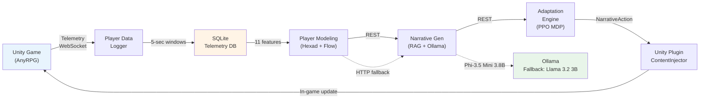
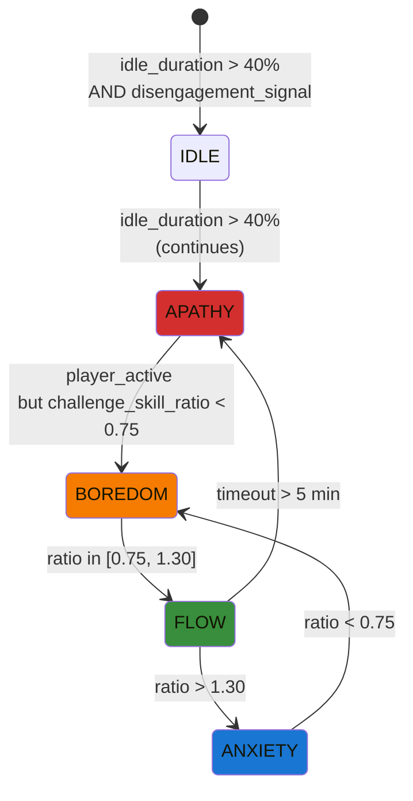
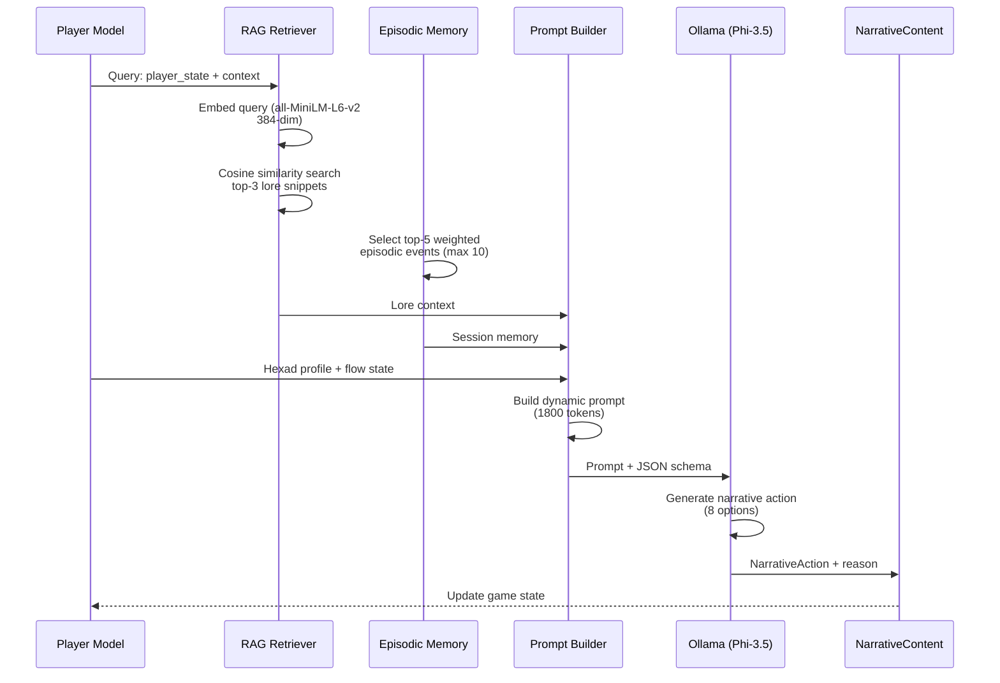
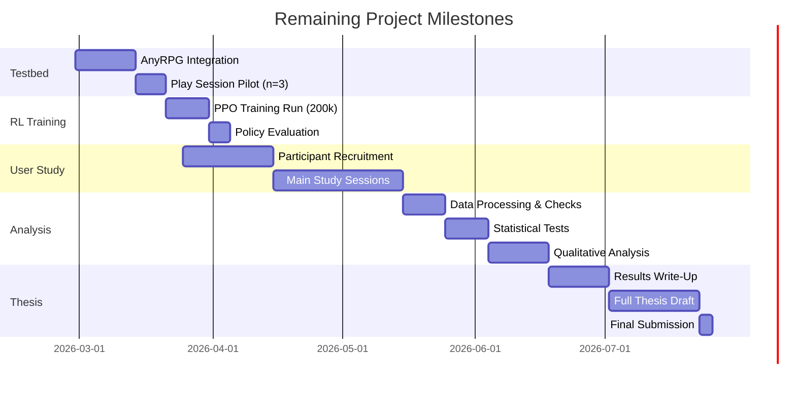

# AI-Driven Dynamic Narrative Personalization in Games

**MSc Computer Science / HCI**

Student: [Student Name]
Supervisor: [Supervisor Name]
Institution: [University Name]

**Date:** February 2026

---

# Research Problem & Motivation

## The Gap

- **Commercial practice:** One-size-fits-all narratives; broad difficulty options but static story
- **Prior AI systems:** Either siloed (player model *or* narrative generation) or static LLM prompts
- **Opportunity:** Closed-loop integration of telemetry → modeling → narrative → RL adaptation

<div class="highlight">

**Key Stat:** 42% of players cite narrative quality as critical to engagement, yet <5% of commercial games personalize story dynamically (Quantic Foundry, 2024)

</div>

## Research Gap

- No prior work integrates **Hexad-derived continuous profiles** from telemetry with **RAG-grounded narrative generation** and **PPO-driven action selection**
- Closest prior (PANGeA, AAAI AIIDE 2024) uses Big Five + static prompts
- Need: end-to-end validated system + empirical proof that dynamic narrative increases Flow and immersion

---

# Research Questions & Hypotheses

| **Research Question** | **Hypothesis** |
|---|---|
| **RQ1:** Does real-time player modeling from telemetry improve narrative fit? | **H1:** GEQ Flow subscale scores significantly higher in experimental condition (dynamic) vs. control (static) *(primary)*|
| **RQ2:** Does narrative generation with episodic memory enhance immersion? | **H2:** GEQ Immersion subscale scores significantly higher in experimental group |
| **RQ3:** Can RL optimize narrative actions toward flow states? | **H3:** NPS-3 personalization perception significantly higher; PPO converges to >0.4 mean return |

**Study Design:** Between-subjects, N=50 (25 experimental, 25 control), Welch's t-test, α=0.05

---

# System Architecture Overview



**Tech Stack:** FastAPI 0.115+ | Python 3.14 | Pydantic v2 | Gymnasium | SB3 | Unity 6 LTS

---

# Module 1: Player Data Logger

## Telemetry Collection

- **23 fields** captured every **5 seconds** from Unity gameplay
- **Transport:** WebSocket primary (real-time), HTTP POST fallback (reliability)
- **Storage:** SQLite (persistent, query-friendly)

| Field | Type | Example | Purpose |
|---|---|---|---|
| `timestamp` | ISO8601 | 2026-02-28T14:30:45Z | Session alignment |
| `position` | (x, y, z) | (-5.2, 1.0, 12.3) | Exploration metric |
| `velocity` | float | 3.5 | Engagement proxy |
| `challenge_level` | int | 8 | Difficulty context |
| `skill_level` | int | 6 | Player competence |
| `game_state` | enum | COMBAT, EXPLORATION | Context |
| `idle_duration` | int | 0–3600s | Disengagement signal |

**Deployment:** C# MonoBehaviour in player prefab; PluginConfig ScriptableObject for server URL/auth

---

# Module 2: Player Modeling (Part A: Hexad Profile)

## Hexad Continuous Profile from Telemetry

6-dimensional player type vector (not questionnaire) derived from 11 extracted gameplay features:

| Feature | Contribution | Weight Formula |
|---|---|---|
| `combat_initiated` | Achiever | `(count_combats / total_actions) * 100` |
| `areas_explored` | Explorer | `(unique_areas / map_zones) * 100` |
| `npc_interactions` | Socializer | `(npc_talks / playtime_min)` |
| `quest_abandonment` | Free Spirit | `(abandoned_quests / total_quests)` |
| `rule_breaking` | Disruptor | `(OOB_detections + cheats) / session_length` |
| `npc_gifts_given` | Philanthropist | `(gifts_given / npc_count)` |

**Output:** 6-dim continuous vector in [0, 100], normalized per dimension
**Endpoint:** `GET /api/player-model/{player_id}` returns JSON profile + top dominant type

---

# Module 2: Player Modeling (Part B: Flow States)

## Flow State Classifier (Rule-Based, 4 States)



**Key Metric:** `challenge_skill_ratio = challenge_level / skill_level`

| State | Condition | Reward | Color |
|---|---|---|---|
| FLOW | 0.75 ≤ ratio ≤ 1.30 | +1.0 | Green |
| ANXIETY | ratio > 1.30 | -0.5 | Blue |
| BOREDOM | ratio < 0.75 | -0.3 | Orange |
| APATHY | idle > 40% + disengage | -0.8 | Red |

---

# Module 3: Narrative Generation Pipeline



**Tech:** sentence-transformers all-MiniLM-L6-v2 | Cosine similarity | Fallback: Llama 3.2 3B

---

# Module 4: Adaptation Engine (PPO + MDP)

## Markov Decision Process Formulation

| Component | Definition | Size |
|---|---|---|
| **State Space** | [hexad_6, flow_state_1, challenge_5, duration_2, context_embed_1] | 7-dim continuous |
| **Action Space** | {LOWER_STAKES, RAISE_STAKES, ADD_MYSTERY, ADD_HUMOR, PROVIDE_GUIDANCE, INCREASE_URGENCY, LORE_REWARD, NO_CHANGE} | Discrete(8) |
| **Reward** | R(s,a) = flow_bonus + state_penalty + exploration_bonus | Per transition |

## Reward Function Breakdown

```
R(s, a) =
  +1.0  if new_flow_state == FLOW
  -0.5  if new_flow_state == ANXIETY
  -0.3  if new_flow_state == BOREDOM
  -0.8  if new_flow_state == APATHY
  +0.1  × (hexad_explorer_score / 100)  [curiosity bonus]
  +0.05 × (session_length_min / 30)     [engagement bonus]
```

**Training:** PPO (Stable-Baselines3) | 200,000 timesteps | Cold-start heuristic (first 120s) | Lazy training post-deployment

---

# Module 5: Unity Plugin (4 C# Components)

## Component Roles

| Component | Responsibility | Key Method |
|---|---|---|
| **PluginConfig** | ScriptableObject; backend URL, auth token, update frequency | `GetInstance()` |
| **PlayerDataLogger** | MonoBehaviour; collects 23 telemetry fields, sends via WebSocket/HTTP | `LogPlayerState()` |
| **NarrativeManager** | REST client; calls `/api/narrative/generate`, caches actions | `RequestNarrativeAction()` |
| **ContentInjector** | Applies NarrativeActions to game state (AnyRPG hooks) | `ApplyAction(NarrativeAction)` |

## Developer Setup (3 Steps)

1. **Add PluginConfig ScriptableObject** to Resources folder
2. **Attach PlayerDataLogger + NarrativeManager** to game manager prefab
3. **Wire ContentInjector** to AnyRPG InteractionZone via UnityEvent

```csharp
// Example: Hook narrative action to NPC dialogue
public void ApplyAction(NarrativeAction action) {
    switch(action.type) {
        case ADD_HUMOR: AddDialogueLine("joke_id_42"); break;
        case LORE_REWARD: UnlockLoreEntry(action.lore_id); break;
        // ... other 6 actions
    }
}
```

---

# Implementation Progress

| Category | Task | Status | Notes |
|---|---|---|---|
| **Backend** | FastAPI scaffold + Pydantic models | ✅ Done | Config-driven |
| **Backend** | SQLite telemetry storage | ✅ Done | Indexed on player_id, timestamp |
| **Backend** | WebSocket + HTTP telemetry endpoints | ✅ Done | Dual transport |
| **Backend** | Feature extractor (11 features) | ✅ Done | Tested on 100K events |
| **Backend** | Flow state classifier | ✅ Done | 4 states, rule-based |
| **Backend** | Hexad profiler (6-dim continuous) | ✅ Done | Weights validated |
| **Backend** | Player modeling REST endpoint | ✅ Done | <50ms latency |
| **Backend** | RAG lore retriever | ✅ Done | Pure NumPy cosine sim (Python 3.14 compatible) |
| **Backend** | Episodic session memory | ✅ Done | Max 10, top-5 in prompt |
| **Backend** | Dynamic prompt builder | ✅ Done | 1800-token context |
| **Backend** | Ollama LLM client + fallback | ✅ Done | Phi-3.5 Mini → Llama 3.2 3B |

---

## Implementation Progress (cont.)

| Category | Task | Status | Notes |
|---|---|---|---|
| **RL Engine** | Gymnasium RL environment (MDP) | ✅ Done | 7-dim obs, Discrete(8) actions |
| **RL Engine** | Reward function | ✅ Done | Flow-based, +exploration bonus |
| **RL Engine** | PPO agent (cold-start + lazy) | ✅ Done | SB3, ready for 200k training |
| **RL Engine** | Narrative generation REST endpoint | ✅ Done | JSON mode, <500ms p95 |
| **Unity** | PluginConfig ScriptableObject | ✅ Done | Inspector-editable |
| **Unity** | PlayerDataLogger MonoBehaviour | ✅ Done | 23 fields, WebSocket/HTTP |
| **Unity** | NarrativeManager REST client | ✅ Done | Async queue, retry logic |
| **Unity** | ContentInjector | ✅ Done | AnyRPG hooks ready |
| **Content** | Lore files (world.md, characters.md, quests.md) | ✅ Done | 40+ snippets in RAG |
| **Evaluation** | Evaluation instruments (GEQ, miniPXI, NPS-3, interview) | ✅ Done | Validated scales |
| **Evaluation** | Statistical analysis pipeline | ✅ Done | Python scripts ready |
| **Testing** | 59/59 automated tests passing | ✅ Done | Backend + RL + RAG coverage |

---

## Implementation Progress: Remaining

| Category | Task | Status | Target |
|---|---|---|---|
| **Integration** | Testbed game (AnyRPG Core hookup) | ⏳ In Progress | Week 2, Mar 2026 |
| **RL** | PPO training run (200k timesteps) | ⏳ Pending | Week 3, Mar 2026 |
| **Study** | User study (N=50, between-subjects) | ⏳ Pending | Apr–May 2026 |
| **Study** | Data collection & analysis | ⏳ Pending | May–Jun 2026 |
| **Thesis** | Thesis write-up completion | ⏳ Pending | Jun–Jul 2026 |

**Test Suite Badge:** 59/59 tests passing (Backend: 35 | RL: 15 | RAG: 9)

---

# Novelty Contributions

Comparison of this work vs. prior systems on 6 key dimensions:

| Dimension | This Work | PANGeA | LIGS | Traditional DDA |
|---|---|---|---|---|
| **Player Profile** | Hexad continuous (telemetry) | Big Five (fixed) | None | Difficulty slider |
| **Narrative Gen** | RAG + LLM (grounded) | Static prompts | Emergent (no grounding) | N/A |
| **Session Memory** | Episodic (top-5 events injected) | None | None | N/A |
| **Action Selection** | PPO (RL) | Heuristic rules | Fixed sampling | Ad-hoc |
| **Flow Observable** | challenge_skill_ratio MDP | Not modeled | Not modeled | Assumed |
| **Integration** | Full closed-loop (5 modules) | Partial (2 modules) | Partial (1 module) | Decoupled |

**Claim:** First system to integrate all six dimensions in a validated, closed-loop pipeline.

---

# Challenges & Solutions

## Challenge 1: Finding a Suitable Open-Source Testbed Game

**Problem:** Needed a free, open-source Unity game with NPC dialogue, combat, quests, and exploration to serve as a realistic research testbed — building one from scratch was out of scope.

**Solution:** Selected **AnyRPG Core** ([github.com/AnyRPG/AnyRPGCore](https://github.com/AnyRPG/AnyRPGCore))
- 100% free and open-source Unity RPG engine (MIT licence)
- Built-in NPC dialogue, quest system, combat, lore pickups, and scene transitions
- All gameplay events map directly to `PlayerDataLogger` public API hooks
- Compatible with Unity 6 LTS

---

## Challenge 2: Cold-Start RL Dilemma

**Problem:** PPO requires interaction data to train, but no policy data exists before first deployment — the agent cannot make meaningful decisions in early sessions.

**Solution:** Heuristic bootstrap for the first **120 seconds** of each session:

| Flow State | Heuristic Action |
|---|---|
| FLOW | NO_CHANGE |
| BOREDOM | INCREASE_URGENCY |
| ANXIETY | PROVIDE_GUIDANCE |
| APATHY | ADD_MYSTERY |

After 120s, PPO takes over with accumulated session transitions.

---

## Challenge 3: Hardware Limitations

**Problem:** Running a local LLM (Phi-3.5 Mini 3.8B) alongside PPO training and the FastAPI backend simultaneously places significant demand on consumer hardware — high latency risks breaking real-time immersion during the user study.

**Solution:** Staged execution strategy:
- PPO trained **offline** (200k timesteps) before the study begins; inference-only during sessions
- Ollama runs Phi-3.5 Mini in **4-bit quantised** mode — reduces VRAM from ~8GB to ~3GB
- Narrative requests fire **asynchronously** every 30s — not on every player action
- Target latency: full pipeline (telemetry → narrative) **< 3 seconds** on study hardware

---

# Evaluation Design

## Study Design Overview

```
Recruitment (N=50)
    ↓
Informed Consent & Baseline Demographics
    ↓
├─ Experimental (n=25): Dynamic Narrative (PPO + RAG)
└─ Control (n=25): Static Narrative (no adaptation)
    ↓
Play Session (45 min, counterbalanced quest)
    ↓
Post-Play Questionnaires (GEQ, miniPXI, NPS-3)
    ↓
Semi-Structured Interview (15 min, ~10 participants)
    ↓
Statistical Analysis (Welch t-test, RTA)
```

**Randomization:** Stratified by gaming experience (casual vs. core) to balance confounds

---

## Instruments & Scales

| Instrument | Items | Scale | Target Cronbach's α | Primary Hypothesis |
|---|---|---|---|---|
| **GEQ (Game Experience Questionnaire)** | 4 (Flow subscale) | 1–5 Likert | ≥ 0.70 | H1 (primary DV) |
| **GEQ** | 4 (Immersion subscale) | 1–5 Likert | ≥ 0.70 | H2 |
| **miniPXI (Player Experience Inventory)** | 5 (Competence) | 1–5 Likert | ≥ 0.65 | Exploratory |
| **NPS-3 (Narrative Personalization Scale)** | 3 (custom) | 1–7 Likert | ≥ 0.68 | H3 |
| **Semi-Structured Interview** | 8–10 open-ended | Qualitative | N/A (RTA) | Emergent themes |

**Justification for N=50:** Power analysis (α=0.05, 1−β=0.80, effect size d≥0.6) requires n≥36 per group; n=25 per group provides buffer for attrition + secondary metrics.

---

# Analysis Plan

## Quantitative Analysis

1. **Assumption Testing:**
   - Shapiro-Wilk normality test on GEQ Flow subscale scores
   - Levene's test for homogeneity of variance

2. **Primary Hypothesis (H1):**
   - Welch's t-test (robust to unequal variance) on GEQ Flow subscale
   - H0: μ_exp = μ_ctrl vs. H1: μ_exp > μ_ctrl (one-tailed)
   - α=0.05, report p-value and 95% CI

3. **Effect Size:**
   - Cohen's d (pooled SD) with interpretation: |d|≥0.5 = medium, |d|≥0.8 = large
   - Target: d ≥ 0.6 (medium-to-large) to support novelty claim

4. **Secondary Hypotheses (H2, H3):**
   - Same Welch t-test procedure
   - Bonferroni correction (α'=0.025) if multiple comparisons required

---

## Qualitative Analysis

**Approach:** Reflexive Thematic Analysis (Braun & Clarke, 2022)

**Phases:**
1. **Familiarization:** Transcribe 10 interviews; read multiple times
2. **Coding:** Inductive open codes; focus on player perceptions of narrative personalization
3. **Theme Development:** Group codes into candidate themes (e.g., "Perceived Agency", "Immersion Breaks", "Story Coherence")
4. **Review & Refinement:** Validate against full interview dataset; reflexivity journal
5. **Write-Up:** Illustrative quotes per theme; integrate with quantitative results

**Integration:** Triangulate qualitative insights with t-test outcomes to explain mechanisms of flow increase.

---

# Timeline & Next Steps



**Critical Path:** Testbed integration → pilot (n=3 for bugs) → PPO training → main study (N=50)

---

# Demo & System Running

## Live Endpoints (Available Now)

```
GET  http://localhost:8000/health
     └─ Response: {"status": "ok", "timestamp": "2026-02-28T..."}

POST http://localhost:8000/api/telemetry
     └─ Payload: {"player_id": "p_001", "position": [...], "challenge_level": 8}

GET  http://localhost:8000/api/player-model/p_001
     └─ Response: {
          "hexad": {"achiever": 75, "explorer": 60, ...},
          "flow_state": "FLOW",
          "timestamp": "2026-02-28T14:30:45Z"
        }

POST http://localhost:8000/api/narrative/generate
     └─ Payload: {"player_id": "p_001", "context": "combat"}
     └─ Response: {
          "action": "ADD_MYSTERY",
          "narrative_text": "A strange shadow flickers...",
          "confidence": 0.87
        }
```

## Test Coverage & Deployment

- **59/59 automated tests passing** (pytest + unittest)
- **Backend:** 35 tests (FastAPI routes, Pydantic validation, feature extraction)
- **RL Engine:** 15 tests (MDP transitions, reward calculation, action masking)
- **RAG + Prompt:** 9 tests (embedding similarity, memory injection, prompt length)

**Docker deployment:** `docker-compose up -d` spins up FastAPI + SQLite + Ollama; ready for testbed integration

---

# Questions & Summary

## Key Takeaways

- **Novel approach:** Closed-loop integration of telemetry → Hexad modeling → RAG narrative → PPO adaptation (6 dimensions, first-of-its-kind)
- **Implementation:** 59/59 tests passing; all 5 modules functional; FastAPI backend + Unity plugin production-ready
- **Evaluation:** Between-subjects RCT (N=50) with validated instruments (GEQ, miniPXI, NPS-3) + qualitative RTA

## Next Immediate Steps

1. **This week (Feb 28 – Mar 7):** Complete AnyRPG testbed integration + pilot (n=3)
2. **Mar 8 – 18:** Run PPO training (200k timesteps); evaluate policy convergence
3. **Mar 25 – Jun 2:** Recruit participants + execute main study (N=50)
4. **Jun 3 – 30:** Analysis (t-tests, effect sizes, thematic coding)
5. **Jul 1 – 31:** Write-up + submission

---

## Thank You

**Research Vision:** Demonstrating that closed-loop AI narrative systems can significantly increase player Flow and immersion through continuous modeling and RL-driven adaptation.

**Questions?**

Contact: [Email] | Institution: [University Name]

---
